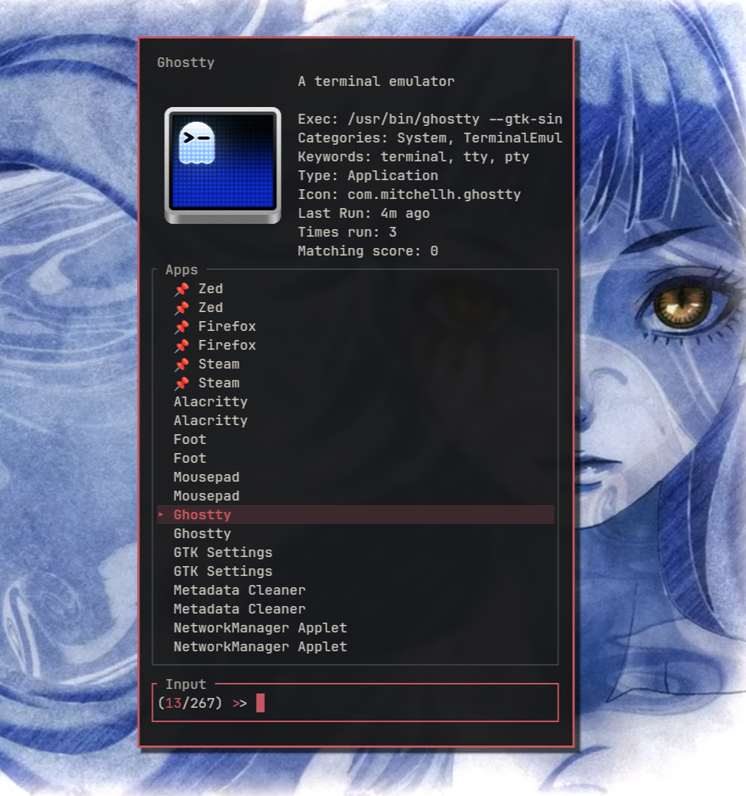
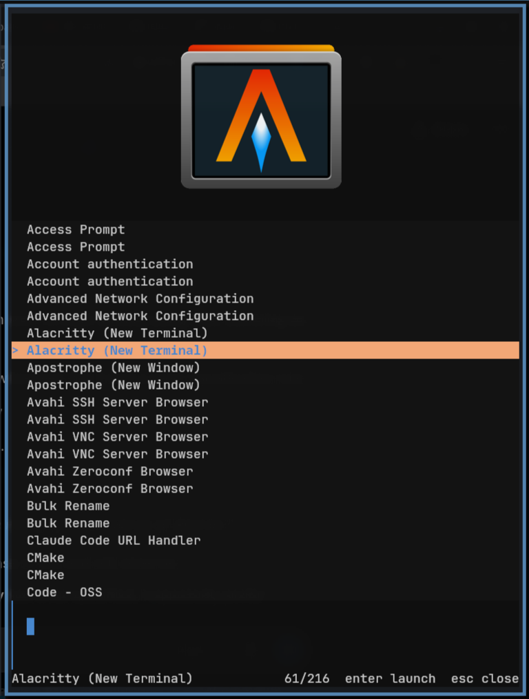

<div align="center">

  

*(fast select)*

  [](https://github.com/Mjoyufull/fsel/blob/main/LICENSE)
  

  Fast TUI app launcher and fuzzy finder for GNU/Linux and \*BSD

  


</div>

## Table of Contents

- [Requirements](#requirements)
- [Quickstart](#quickstart)
- [Documentation](#documentation)
- [Install](#install)
- [Usage](#usage)
- [Configuration](#configuration)
  - [Environment variable overrides](#environment-variable-overrides)
- [Contributing](#contributing)
- [Troubleshooting](#troubleshooting)
- [License](#license)

**Start Here:** [Detailed Usage Guide](./USAGE.md)

## Requirements

**Build Requirements:**
- Rust 1.94+ **stable** (NOT nightly)
  - Install: `curl --proto '=https' --tlsv1.2 -sSf https://sh.rustup.rs | sh`
  - Verify: `rustc --version` (should show stable, not nightly)
  - If using nightly: `rustup default stable`
- Cargo (comes with Rust)

**Runtime Requirements:**
- GNU/Linux or *BSD
- Terminal emulator

**Optional:**
- [`cclip`](https://github.com/heather7283/cclip) - for clipboard history mode
- Kitty, Sixel-, or Halfblocks-capable terminal - for native inline image previews in cclip mode (see [ratatui-image](https://github.com/benjajaja/ratatui-image))

**Note:** Image previews in cclip mode use built-in [ratatui-image](https://github.com/benjajaja/ratatui-image) (no external viewer). Versions before 3.1.0 required `chafa` for image previews; 3.1.0 and later do not.

## Quickstart

Get up and running in 30 seconds:

```sh
# Install with Nix (recommended)
nix run github:Mjoyufull/fsel

# Or install from Cargo
cargo install fsel@4.0.0-nyamabeetle

# Launch fsel
fsel

# Use as dmenu replacement
echo -e "Option 1\nOption 2\nOption 3" | fsel --dmenu

# Browse clipboard history (requires cclip)
fsel --cclip
```

That's it. Type to search, arrow keys to navigate, Enter to launch.

Need install variants, launch methods, or mode-specific examples? See [USAGE.md](./USAGE.md).

Make the layout yours: dock panels around the results, add independent dmenu previews, move them
interactively, or switch the launcher to an icon grid with distinct pinned-row colors.
All layouts are opt-in; see [panel and grid options](./USAGE.md#panel-layouts).


## Install

#### Option 1: Nix Flake (Recommended)

* Build and run with Nix flakes:
    ```sh
    $ nix run github:Mjoyufull/fsel
    ```

* Add to your profile:
    ```sh
    $ nix profile add github:Mjoyufull/fsel
    ```

* Add to your `flake.nix` inputs:
    ```nix
    {
      inputs.fsel.url = "github:Mjoyufull/fsel";
      # ... rest of your flake
    }
    ```

#### Option 2: Cargo (Latest Release)

* Build and install via Cargo:
    ```sh
    $ cargo install fsel@4.0.0-nyamabeetle
    ```
* To update later:
    ```sh
    $ cargo install fsel@4.0.0-nyamabeetle --force
    ```
* Or install latest version (check [releases](https://github.com/Mjoyufull/fsel/releases)):
    ```sh
    $ cargo search fsel  # See available versions
    $ cargo install fsel@<version>
    ```

#### Option 3: AUR (Arch Linux)

* Install the git version with your favorite AUR helper:
    ```sh
    $ yay -S fsel-bin
    # or
    $ paru -S fsel-git
    ```
* Or manually:
    ```sh
    $ git clone https://aur.archlinux.org/fsel-bin.git
    $ cd fsel-bin
    $ makepkg -si
    ```
#### Option 4: Void linux (Unoffical Repo)

* Install fsel on void
    ```sh
    echo repository=https://raw.githubusercontent.com/Event-Horizon-VL/blackhole-vl/repository-x86_64 | sudo tee /etc/xbps.d/20-repository-extra.conf
    sudo xbps-install -S fsel
    ```
#### Option 5: Build from source

* Install [Rust](https://www.rust-lang.org/learn/get-started) stable
* Build:
    ```sh
    $ git clone https://github.com/Mjoyufull/fsel && cd fsel
    $ cargo build --release
    ```
* Copy `target/release/fsel` to somewhere in your `$PATH`
* (Optional) Create a dmenu symlink for drop-in compatibility:
    ```sh
    $ ./create_dmenu_symlink.sh
    ```
    Or manually: `ln -s $(which fsel) ~/.local/bin/dmenu`

### Optional Dependencies

* **uwsm** - Universal Wayland Session Manager (for `--uwsm` flag)
* **systemd** - For `--systemd-run` flag
* [**cclip**](https://github.com/heather7283/cclip) - Clipboard manager (for `--cclip` mode)
* **Kitty, Foot, WezTerm, or other Sixel/Kitty/Halfblocks-capable terminal** - For native inline image previews in cclip mode (powered by [ratatui-image](https://github.com/benjajaja/ratatui-image); no chafa needed in 3.1.0+)
* [**otter-launcher**](https://github.com/kuokuo123/otter-launcher) - Pairs nicely with fsel for a complete launcher setup see [Usage](./USAGE.md)

## Usage

### Interactive Mode

Run `fsel` from a terminal to open the interactive TUI launcher.

```sh
# Launch fsel
fsel

# Pre-fill search (must be last)
fsel -ss firefox

# Direct launch (no UI)
fsel -p firefox
```

**Highlights:**
- **Graphics & Icon System**: Native Kitty, Sixel, and half-block icon/image previews in title preview, beside in listed apps, or an icon grid.
- **Layout Customization**: Flexible dockable panels around results (top, right, bottom, left), interactive panel movement (`--panel-edit`) and multi-panel dmenu previews.
- **Persistent Detached Launching**: Launch multiple apps without closing fsel (`--detach --persistent`), with `--on-launch` scripting hooks.
- **Advanced Search Ranking**: Configurable scoring with `frecency`, `recency`, or `frequency`
- **Smart Matching & Deduplication**: Fuzzy or exact search across names, descriptions, and keywords, with deterministic XDG duplicate suppression.
- **Pin & Hide Controls**: Favorite apps with Ctrl-Space; persistently hide noisy entries with Alt-Delete (Alt-U to restore).

```sh
# Launch multiple apps without losing your search query, selection, or warm icons
fsel --detach --persistent

# Run a post-launch hook (e.g., closing your window or notifying external scripts)
fsel --detach --persistent --on-launch 'swaymsg [app_id="launcher"] kill'
```

See [USAGE.md - App Launcher](./USAGE.md#app-launcher) for TTY mode, launch prefixes, `--detach`, persistent sessions, reacting to launches, and cache management.

Hidden entries are stored in fsel's database; their `.desktop` files and executables are not changed.
Manage persistent hides without opening the TUI:

```sh
fsel --list-hidden
fsel --unhide 12
fsel --unhide-all
```

Set `auto_hide_duplicates = true` under `[app_launcher]` to suppress entries with the same
desktop-file ID or normalized visible name. It defaults to `false`; manual hiding always targets
one exact source path, including duplicate entries in the same directory or across Bedrock strata.

### Direct Launch Mode

Launch applications directly from the command line without opening the TUI:

```sh
# Launch Firefox directly
fsel -p firefox

# Launch the best fuzzy match for "terminal" (default match mode)
fsel -p terminal

# Partial names work while match_mode is fuzzy
fsel -p fire  # Finds Firefox

# Exact mode requires an exact app or executable name
fsel --match-mode=exact -p firefox
fsel --match-mode=exact -p fire   # Fails: no exact match

# Combine with launch options
fsel --launch-prefix="runapp --" -p discord
fsel --uwsm -p discord
fsel --systemd-run -vv -p code
```

### Dmenu Mode

Fsel includes a full dmenu replacement mode that reads from stdin and outputs selections to stdout:

```sh
# Basic dmenu replacement
echo -e "Option 1\nOption 2\nOption 3" | fsel --dmenu

# Display only specific columns (like cut)
ps aux | fsel --dmenu --with-nth 2,11  # Show only PID and command

# Use custom delimiter
echo "foo:bar:baz" | fsel --dmenu --delimiter ":"

# Pipe from any command
ls -la | fsel --dmenu
find . -name "*.rs" | fsel --dmenu
git log --oneline | fsel --dmenu

# Live command preview ({} expands to selected line, {q} to query, {n} to 0-based index)
find . -type f | fsel --preview 'file --brief {}'

# Render syntax-highlighted code or text previews
find . -name "*.rs" | fsel --preview 'bat --color=always --style=numbers {}'

# Inline image previews with Kitty, Sixel, or half-block fallback (PNG, JPEG, SVG, WebP, GIF)
find ~/Pictures -type f | fsel --preview 'cat {}'

# Multi-panel layouts: dock up to 3 independent command/image panels
fsel --dmenu --panel "top:git status -s" --panel "right:git diff HEAD -- {}"

# Interactive layout editing: press Alt+P to drag, dock, and resize panels live
fsel --dmenu --preview 'cat {}' --panel-edit
```

See [USAGE.md - Dmenu Mode](./USAGE.md#dmenu-mode) for multi-panel docking, interactive panel editing, column operations, password input, pre-selection, exact matching, `--index-original`, and prompt-only mode.

### Clipboard History Mode
Requires [cclip](https://github.com/heather7283/cclip).


Browse and select from your clipboard history with formatted text rendering and image previews:

```sh
# Browse clipboard history with cclip integration
fsel --cclip

# Filter by tag
fsel --cclip --tag prompt

# List all tags
fsel --cclip --tag list

# List items with specific tag (verbose shows details)
fsel --cclip --tag list prompt -vv

# Copy rendered HTML as plain text instead of raw markup (-x)
fsel --cclip -x

# Inspect raw HTML payloads and MIME diagnostics while copying rendered plain text (-vvx)
fsel --cclip -vvx

# Clear tag metadata from fsel database
fsel --cclip --tag clear

# Show tag color names in display
fsel --cclip --cclip-show-tag-color-names
```

HTML entries are rendered as readable text by default with entity decoding. Press `Alt+i` on any entry for a fullscreen scrollable preview (images or word-wrapped text). Use `-x` to copy rendered text, or `-vvx` to inspect raw HTML markup and diagnostics in the TUI while copying clean text.

See [USAGE.md - Clipboard Mode](./USAGE.md#clipboard-mode) for tag management, keybindings, inline image details, and more clipboard-specific behavior.

### Command Line Help

```sh
# Quick overview grouped by mode/flags
fsel -h

# Full tree-style reference covering every option
fsel -H

# Show verbose output
fsel -vvv
```

See [USAGE.md](./USAGE.md) for more examples, launch methods, scripting recipes, debugging notes, [environment variables](./USAGE.md#environment-variables), and advanced usage.

## Configuration

Config file: `~/.config/fsel/config.toml`

<div align="center">
  
</div>

### Basic Setup

```toml
# Colors
highlight_color = "LightBlue"
cursor = "█"

# App launcher
terminal_launcher = "alacritty -e"

# Shared launcher, dmenu, and cclip visual settings
pin_color = "rgb(255,165,0)"       # Color for pin icon (orange)
pin_icon = "📌"                     # Icon for pinned apps
items_background_color = "Reset"  # Items panel background
items_selection_background_color = "Reset" # Selected row background
items_selection_rounded = false    # Optional half-cell rounded row ends
main_background_color = "Reset"   # Main info panel background
input_background_color = "Reset"  # Input panel background
show_main_border = true
show_items_border = true
show_input_border = true
show_panel_titles = true
show_input_count = true
show_input_prompt = true
show_selection_marker = true
selection_marker = ">"              # Any marker text, for example "█"
show_pin_icons = true
input_panel_style = "classic"       # "classic" or "command"

[app_launcher]
filter_desktop = true              # Filter apps by desktop environment
filter_actions = false            # Keep desktop actions visible; set true to hide them
auto_hide_duplicates = false      # Opt in to deterministic duplicate suppression
list_executables_in_path = false   # Show CLI tools from $PATH
match_mode = "fuzzy"               # "fuzzy" or "exact"
ranking_mode = "frecency"          # "frecency", "recency", or "frequency"
pinned_order = "ranking"           # "ranking", "alphabetical", "oldest_pinned", "newest_pinned"
icon_mode = "preview"               # "preview", "list", "both", or "none"
icon_position = "left"              # Preview: "left", "center", or "right"
icon_preview_width_percent = 40
icon_list_width = 4                  # Terminal columns reserved beside each app
icon_list_height = 2                 # Terminal rows per app when list icons are enabled
icon_list_gap = 1                    # Columns between each list icon and label
icon_list_vertical_align_percent = 0 # Offset artwork vertically; negatives overflow upward
icon_arrow_before = false            # Put selection arrow before left-side list icons
icon_size = 128
icon_horizontal_align_percent = 50  # Fine adjustment inside the chosen icon area
icon_vertical_align_percent = 50    # Fine adjustment inside the preview icon area
# icon_theme = "Papirus-Dark"       # Optional override; desktop settings are detected by default
```


The neutral `items_*` settings theme launcher results, dmenu choices, and cclip history (`apps_*` names remain supported as backward-compatible aliases).

Desktop icons resolve automatically from active XDG icon themes (GTK, KDE, and LXQt detected) or absolute `Icon=` paths. PNG and SVG icons render through Kitty, Sixel, or the half-block fallback. Choose `icon_mode = "preview"` (in title bar), `"list"` (beside results), `"both"`, or `--app-grid`. Fine-tune list layout with `icon_list_width`, `icon_list_height`, `icon_list_gap`, and `icon_list_vertical_align_percent`.

Field placement matters: root UI options and `[app_launcher]`, `[dmenu]`, and `[cclip]` sections are validated separately. See [config.toml](./config.toml) and [keybinds.toml](./keybinds.toml) for all available options with detailed comments. `[app_launcher].match_mode = "exact"` also applies to `-p/--program`, where it requires an exact app or executable name.

### Environment variable overrides

After the config file is loaded, any `FSEL_*` variable set in the process environment overrides the corresponding setting. Use this for one-off launches, wrappers, or systemd units without editing `config.toml`.

- **Root / shared keys:** `FSEL_` plus the uppercase TOML key (e.g. `match_mode` → `FSEL_MATCH_MODE`).
- **Section keys:** `FSEL_DMENU_*`, `FSEL_CCLIP_*`, and `FSEL_APP_LAUNCHER_*` mirror `[dmenu]`, `[cclip]`, and `[app_launcher]` fields.

```sh
FSEL_MATCH_MODE=exact fsel
FSEL_APP_LAUNCHER_FILTER_ACTIONS=true fsel
FSEL_HIGHLIGHT_COLOR=Cyan FSEL_DMENU_DELIMITER=: fsel --dmenu < items.txt
```

`man fsel` summarizes this under **ENVIRONMENT**. For the full variable list, see [Environment variables](./USAGE.md#environment-variables) in [USAGE.md](./USAGE.md).

### Window Manager Integration

**Sway/i3:**
```sh
# ~/.config/sway/config
set $menu alacritty --title launcher -e fsel
bindsym $mod+d exec $menu
for_window [title="^launcher$"] floating enable, resize set width 500 height 430, border none

# Clipboard history
bindsym $mod+v exec 'alacritty --title clipboard -e fsel --cclip'
```

**Hyprland (Lua configuration):**
```lua
-- ~/.config/hypr/hyprland.lua
hl.config({
    bind = {
        { mods = { "SUPER" }, key = "D", action = "exec", arg = "alacritty --title launcher -e fsel" },
        { mods = { "SUPER" }, key = "V", action = "exec", arg = "alacritty --title clipboard -e fsel --cclip" },
    },
    windowrules = {
        { rule = "float", match = { title = "^launcher$" } },
        { rule = "center", match = { title = "^launcher$" } },
        { rule = "size 500 430", match = { title = "^launcher$" } },
        { rule = "float", match = { title = "^clipboard$" } },
        { rule = "center", match = { title = "^clipboard$" } },
        { rule = "size 700 500", match = { title = "^clipboard$" } },
    }
})
```

**Niri:**
```kdl
# ~/.config/niri/config.kdl
window-rule {
    match title="launcher"
    open-floating true
    default-column-width { fixed 500; }
    default-window-height { fixed 430; }
}

# Add inside binds { ... }
Mod+D { spawn "alacritty" "--title" "launcher" "-e" "fsel"; }
```

**dwm/bspwm/any WM:**
```sh
# Use dmenu mode
bindsym $mod+d exec "fsel --dmenu | xargs swaymsg exec --"
```

## Contributing

Contributions are welcome! Whether you're reporting bugs, suggesting features, or submitting code, we appreciate your help making fsel better.

### How to Contribute

1. **Bug Reports & Feature Requests**: Open an issue on [GitHub Issues](https://github.com/Mjoyufull/fsel/issues)
2. **Pull Requests**: Fork the repo, create a feature branch, and submit a PR
3. **Code Style**: Run `cargo fmt` and `cargo clippy` before submitting
4. **Testing**: Ensure `cargo test` and `cargo build --release` pass

### Development Workflow

See [CONTRIBUTING.md](./CONTRIBUTING.md) for detailed guidelines on:
- Branch naming conventions
- Commit message format
- Pull request process
- Code review standards
- Release procedures

All contributors are valued and appreciated. Your name will be added to the contributors list, and significant contributions will be highlighted in release notes.

Thank you for helping improve fsel!

## Philosophy

fsel is a **unified TUI workflow tool** built for terminal-centric setups, combining fast application launching, dmenu piping, and rich clipboard history into a single cohesive interface with shared theming and keybinds.

While crafted around a keyboard-driven workflow, **community contributions and feature suggestions are warmly welcomed!** Whether you have ideas for new layout customizations, integration scripts, performance improvements, or bug fixes, feel free to open an issue or start a discussion on GitHub. If something could make fsel better for your daily driver setup, we'd love to collaborate on it.

---

## Troubleshooting

**Apps not showing up?**
- Check `$XDG_DATA_DIRS` includes `/usr/share/applications`
- Try `--filter-desktop=no` to disable desktop filtering
- Use `-vvv` for debug info

**Mouse not working?**
- Check your terminal supports mouse input
- Try `disable_mouse = false` in config

**Images not showing in cclip mode?**
- Use a Kitty-, Sixel-, or Halfblocks-capable terminal (e.g. Kitty, Foot, WezTerm). Image preview uses built-in [ratatui-image](https://github.com/benjajaja/ratatui-image); no chafa or other external viewer is needed (3.1.0+).
- Check `image_preview = true` in config
- Images render inside the content panel; press Alt+i for fullscreen preview
- Alt+i also opens full clipboard text with wrapping: j/k scroll, Space/b page, g/G jump to the ends, q returns

**Fuzzy matching too loose?**
- Try `--match-mode=exact` for stricter matching
- Or set `match_mode = "exact"` in config

**Too many desktop action entries?**
- Use `--filter-actions` to hide desktop actions like "New Window"
- Or set `filter_actions = true` under `[app_launcher]`

**Hidden the wrong launcher entry?**
- Press Alt-U before leaving the launcher to restore the most recent hide
- Run `fsel --list-hidden`, then `fsel --unhide <ID>` to restore a specific entry
- Run `fsel --unhide-all` to clear every manual hide

**Terminal apps not launching?**
- Set `terminal_launcher` in config
- Example: `terminal_launcher = "kitty -e"`

## Credits

Fork of [gyr](https://git.sr.ht/~nkeor/gyr) by Namkhai B.

## License

[BSD 2-Clause](./LICENSE) (c) 2020-2022 Namkhai B., Mjoyufull
